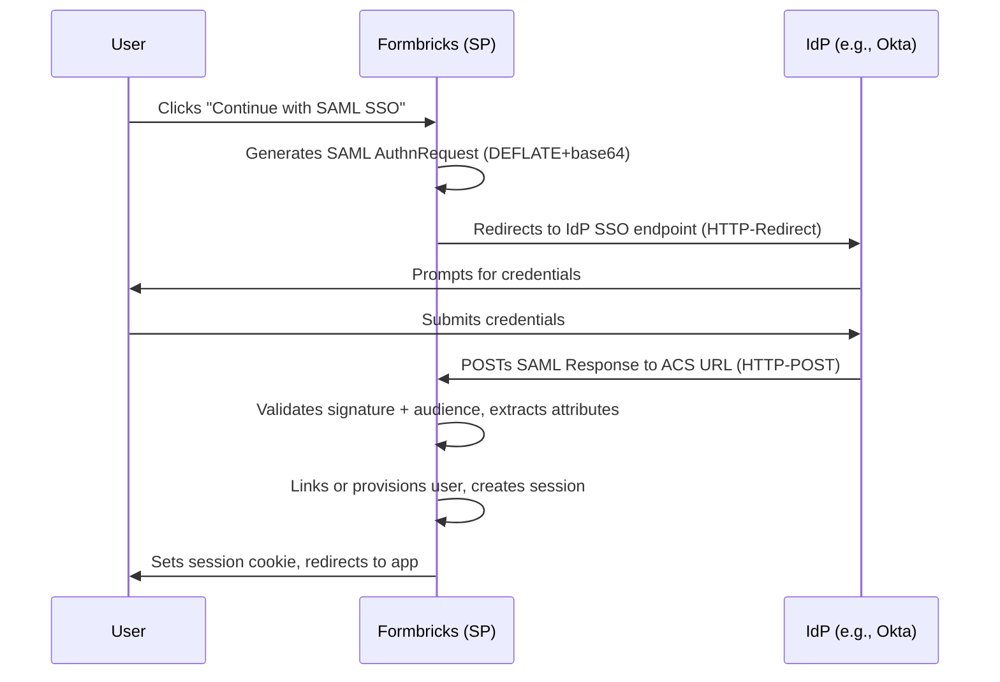

<Note>SAML SSO is available in this AGPL fork without a license key (upstream: [Enterprise Edition](/self-hosting/advanced/license))</Note>

## Overview

Formbricks supports SAML 2.0 Single Sign-On (SSO) to enable secure, centralized authentication. Organizations can integrate their existing Identity Provider (IdP) infrastructure for streamlined access management. This implementation uses native Node.js modules only (`node:crypto`, `node:zlib`) — no external SAML service dependencies.

## How SAML works in Formbricks

SAML (Security Assertion Markup Language) is an XML-based standard for exchanging authentication and authorization data between an Identity Provider (IdP) and Formbricks (the Service Provider). Here's how the integration works:

1. **Login Initiation**  
   The user clicks `Continue with SAML SSO` on the Formbricks login page. This calls `signIn("saml")` which redirects to `/api/auth/saml/login`.

2. **AuthnRequest Generation**  
   Formbricks generates a SAML AuthnRequest XML, DEFLATE-compresses it, base64-encodes it, and redirects the browser to the IdP's SSO endpoint via HTTP-Redirect binding with the `SAMLRequest` query parameter. The `RelayState` carries the user's intended callback URL.

3. **Authentication at IdP**  
   The user authenticates directly with the IdP (e.g., Okta, Azure AD, Keycloak).

4. **SAML Response**  
   Upon successful authentication, the IdP sends a signed SAML Response back to Formbricks via the user's browser using HTTP-POST binding to the Assertion Consumer Service (ACS) endpoint at `/api/auth/saml/callback`.

5. **Assertion Validation**  
   Formbricks parses and validates the SAML Response:
   - Verifies the signature using the configured IdP certificate (`SAML_IDP_CERT`)
   - Validates the audience (`SAML_AUDIENCE`, defaults to `https://saml.formbricks.com`)
   - Extracts user attributes (email, name) from the assertion

6. **User Provisioning / Linking**  
   - If an Account link exists for the SAML provider + email → link and sign in
   - Else if a legacy User-level identity record exists → link and sign in  
   - Else if a user with the same email exists → link SAML identity and sign in
   - Else create new user + organization + default workspace, then sign in

7. **Session Creation**  
   Formbricks creates a NextAuth database session, sets the session cookie, and redirects the user to the app.

## SAML Auth Flow Sequence Diagram



## Configuration

SAML SSO is enabled when **both** of the following environment variables are set:

- `SAML_IDP_SSO_URL` — The IdP's Single Sign-On endpoint URL (e.g., `https://your-org.okta.com/app/.../sso/saml`)
- `SAML_IDP_CERT` — The IdP's X.509 signing certificate in PEM format (used to validate SAML assertions)

Optional environment variables:

- `SAML_IDP_ENTITY_ID` — The IdP's Entity ID (defaults to `SAML_IDP_SSO_URL` if not set)
- `SAML_IDP_METADATA_URL` — Optional URL to fetch IdP metadata dynamically (alternative to manual SSO URL + cert)

<Note>
`SAML_DATABASE_URL`, `connection.xml`, and BoxyHQ/Jackson references in older documentation are legacy artifacts and **not used** in this AGPL fork. They can be safely ignored.
</Note>

## Setting Up SAML SSO

Follow these steps to configure SAML SSO in Formbricks:

<Steps>
  <Step title="Configure IdP Application">
    Create a SAML application in your Identity Provider (Okta, Azure AD, Keycloak, etc.) following your provider's instructions. Note the following values:
    - **SSO URL** (or Single Sign-On URL) → `SAML_IDP_SSO_URL`
    - **Signing Certificate** (X.509 PEM) → `SAML_IDP_CERT`
    - **Entity ID** (optional) → `SAML_IDP_ENTITY_ID`
    - **ACS URL** (Assertion Consumer Service) → `{WEBAPP_URL}/api/auth/saml/callback` (e.g., `https://formbricks.example.com/api/auth/saml/callback`)
    - **Audience / SP Entity ID** → `https://saml.formbricks.com` (fixed)
    - **NameID Format** → `urn:oasis:names:tc:SAML:1.1:nameid-format:emailAddress`
    - **Attribute Mappings** (email required, name optional):
      - Email: `urn:oid:0.9.2342.19200300.100.1.3`, `http://schemas.xmlsoap.org/ws/2005/05/identity/claims/emailaddress`, `mail`, `email`
      - Name: `urn:oid:2.5.4.42`, `http://schemas.xmlsoap.org/ws/2005/05/identity/claims/name`, `displayName`, `cn`
  </Step>

  <Step title="Set Environment Variables">
    Add the required variables to your environment (`.env` or Docker environment):
    ```bash
    # Required
    SAML_IDP_SSO_URL=https://your-idp.com/sso/saml
    SAML_IDP_CERT="-----BEGIN CERTIFICATE-----\nMII...\n-----END CERTIFICATE-----"
    # Optional
    SAML_IDP_ENTITY_ID=https://your-idp.com/entity
    # Alternative to SSO_URL+CERT: fetch metadata dynamically
    # SAML_IDP_METADATA_URL=https://your-idp.com/metadata
    ```
  </Step>

  <Step title="Restart Formbricks">
    Restart the Formbricks containers to apply the changes:
    ```bash
    docker compose down && docker compose up -d
    ```
  </Step>
</Steps>

<Note>
Only a single SAML connection is supported at a time. To change providers, update the environment variables and restart.
</Note>

## Troubleshooting

- **"SAML SSO is not configured"** — `SAML_IDP_SSO_URL` is missing or empty.
- **"Missing SAML Response"** — IdP did not POST a SAMLResponse to the ACS endpoint. Verify ACS URL in IdP matches `{WEBAPP_URL}/api/auth/saml/callback`.
- **Signature validation failed** — `SAML_IDP_CERT` does not match the IdP's signing certificate. Ensure the certificate is in PEM format (includes `-----BEGIN CERTIFICATE-----`).
- **Audience validation failed** — The SAML assertion's AudienceRestriction does not match `https://saml.formbricks.com`. Verify the IdP's Audience / SP Entity ID configuration.
- **User not provisioned** — Check logs for "SAML callback failed". Ensure the IdP sends an email attribute in the assertion.